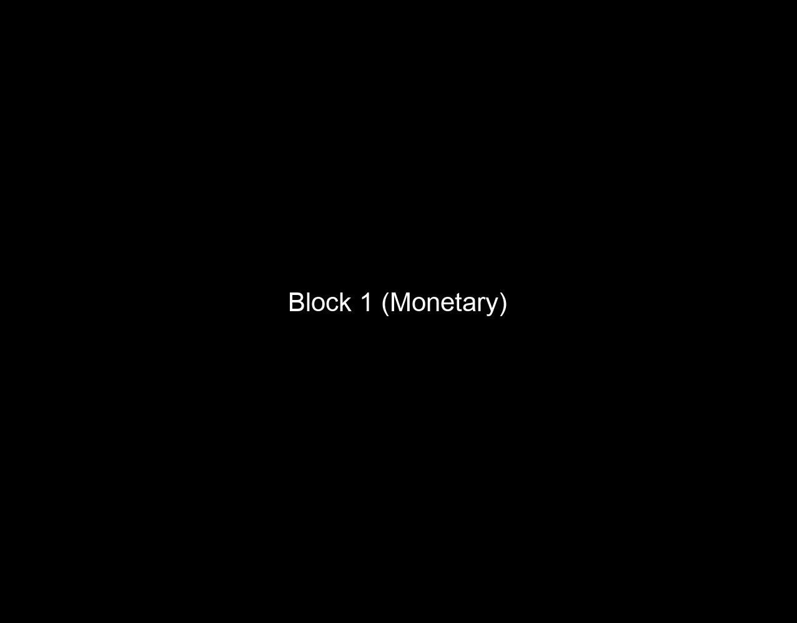

# High-/Low-Fat Food Task (HLFF)

## General description

There are monetary blocks and food
blocks, and there are two kinds of food blocks (pretzels and Oreos).
In the monetary blocks, users are asked to choose between a
guaranteed payment of \$5 and a lottery with possible outcomes of \$0
and some positive amount of \$ up to \$25 (no ambiguity –
probabilities are unambiguous and add up to 100%).

In the food blocks, users are asked to choose between a set quantity
of the food in question (10 units) and a lottery with possible
outcomes of 0 units of food (e.g. 0 pretzels) and some positive
number of units of food (no ambiguity – probabilities are
unambiguous and add up to 100%).

The trial begins with the display of the choice, which remains
displayed for the whole duration of the trial (until the user
submits choice or 10 seconds elapses, whichever comes first). The
user has must submit their choice within this 10-second time frame.

## User interface

The task is operated with the following keypresses:

* \[5/%\] to begin a block; 
* \[1/!\] for the left option and \[2/@\] for the right option.

## Session properties

There are six blocks, with 20 trials each.

## Trial properties

### Contingencies

-   **Probabilities:** 0.25, 0.5, 0.75
-   **Ambiguities:** none

### Domain payoffs

-   **Monetary:** \$0 (loss only), \$5, \$8, \$12, \$25
-   **High-fat foods:** no Oreos (loss only), 4 Oreos, 6 Oreos, 9
    Oreos, 18 Oreos
-   **Low-fat foods:** no pretzels (loss only), 10 pretzels, 15
    pretzels, 20 pretzels, 30 pretzels

### Time involved

- **Duration of choice display:** infinite, until the participant
  chooses
- **Duration of feedback** (after choice is made): 0.5
  seconds
- **Duration of ITI:** 2 seconds (early choice won’t add to ITI)

## Example

