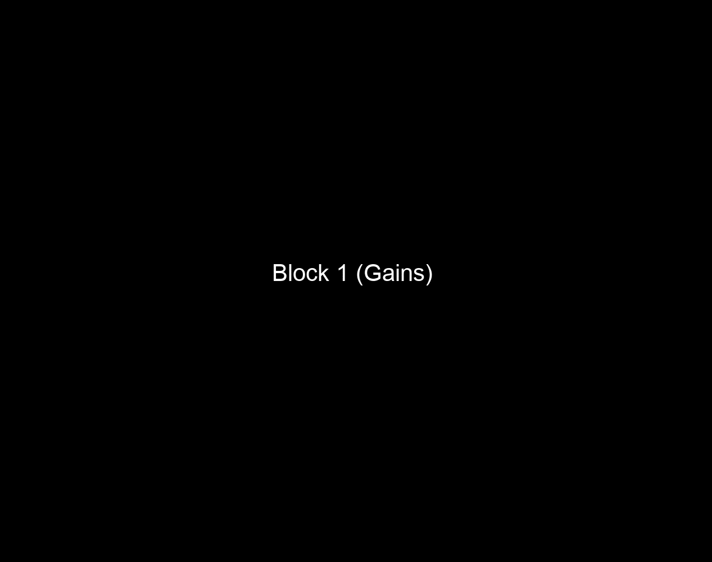

# Risk & Ambiguity Task (RA)

## General description

This task consists of “loss” blocks
and “gains” blocks. In “loss” blocks, users are asked to choose
which loss they’d prefer: a guaranteed loss of \$5 (represented as
-\$5), or a lottery that results in loss of \$0 or loss of an amount
of money greater in magnitude than \$5. In “gains” blocks, users are
asked which gain they’d prefer: a guaranteed gain of \$5, or a
lottery that results in a gain of either \$0 or some positive
amount of money. The choice is displayed for 6 seconds; afterwards,
(as indicated by the green dot), the user has 3.5 seconds to submit
their choice.

## User interface

The task is operated with the following keypresses:

- \[5/%\] to begin a block; 
- \[1/!\] for the left option  and \[2/@\] for the right option.

## Session properties
Each block has 31 trials; there are 8 blocks total, typically administered in two sessions on separate days.

## Trial properties

### Contingencies

-   **Probabilities:** 0.25, 0.5, 0.75
-   **Ambiguities:** 0.24, 0.5, 0.74
### Domain payoffs

- **Gains:** \$0 (loss only), 5,6, 7, 8, 10, 12, 14, 16, 19,
  23, 27, 31, 37, 44, 52, 61, 73, 86, 101, 120
- **Losses** dollar amounts of the same magnitude, but with a minus sign in front

### Time involved

-   Duration of choice display: exactly 6 seconds
-   Duration of response window: exactly 3.5 seconds
-   Duration of feedback duration (after choice is made): 0.5
  seconds
-   Duration of ITI: 10 seconds for the initial catch trial in
  each box; 10 4-second ITI’s, 10 6-second ITI’s, and 10
  10-second ITI’s randomly distributed across the rest of
  the block.

## Example

